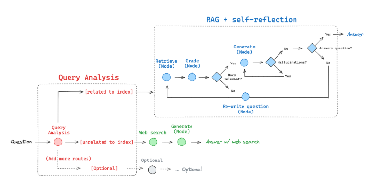
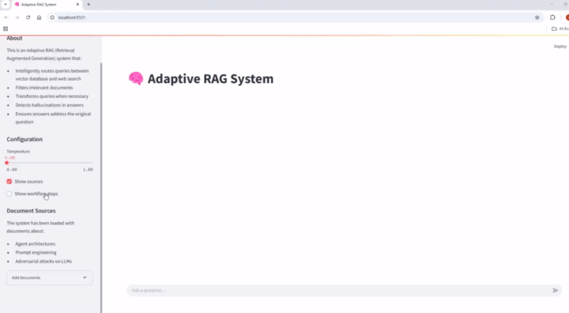

# Adaptive RAG

An advanced Retrieval Augmented Generation (RAG) system that dynamically adapts to user queries through intelligent routing, document grading, and query transformation.



## Features

- **Adaptive Routing**: Intelligently routes queries between vectorstore and web search
- **Document Relevance Grading**: Filters retrieved documents based on relevance
- **Query Transformation**: Reformulates queries to improve retrieval quality
- **Hallucination Detection**: Ensures generated responses are grounded in retrieved context
- **Answer Quality Assessment**: Verifies that responses properly address the original query
- **LangGraph Workflow**: Orchestrated with a flexible state machine workflow
- **Multiple UI Options**: Choose between Streamlit, Gradio, or Flask interfaces

## Getting Started

### Prerequisites

- Python 3.9+
- API keys for:
  - OpenAI (required)
  - Tavily (for web search)
  - LangSmith (for tracing, optional)

### Installation

1. Clone this repository:
```bash
git clone https://github.com/affanrasheed/Adaptive_RAG.git
cd Adaptive_RAG
```

2. Install dependencies:
```bash
pip install -e .
```

3. Create a `.env` file based on the provided `.env.example`:
```bash
cp .env.example .env
```

4. Edit the `.env` file with your API keys:
```
OPENAI_API_KEY=your_openai_api_key
TAVILY_API_KEY=your_tavily_api_key
LANGSMITH_API_KEY=your_langsmith_api_key
```

### Running Examples

```bash
python examples/simple_question.py
```

### Launching the UI

```bash
# Launch the default Streamlit UI
python ui/launch_ui.py

# Or specify a UI type
python ui/launch_ui.py --ui gradio
python ui/launch_ui.py --ui flask
```
## Demo

## Usage

```python
from adaptive_rag import AdaptiveRAG

# Initialize the RAG system
rag = AdaptiveRAG()

# Run a query
response = rag.query("What are the types of agent memory?")
print(response)
```

## Customization

The system is modular and can be customized:

```python
from adaptive_rag import AdaptiveRAG
from adaptive_rag.components import CustomRetriever, CustomGrader

# Create a custom RAG system
custom_rag = AdaptiveRAG(
    retriever=CustomRetriever(),
    document_grader=CustomGrader(),
    model="gpt-4"
)
```

## Architecture

The system uses a LangGraph workflow to coordinate components:

1. **Routing**: Decides between vectorstore retrieval or web search
2. **Retrieval**: Gets relevant documents from the chosen source
3. **Grading**: Assesses document relevance to the query
4. **Generation**: Produces an answer based on relevant documents
5. **Evaluation**: Checks for hallucinations and response quality

## License

This project is licensed under the MIT License - see the LICENSE file for details.

## Acknowledgements

- Built with [LangChain](https://github.com/langchain-ai/langchain)
- Workflow powered by [LangGraph](https://github.com/langchain-ai/langgraph)